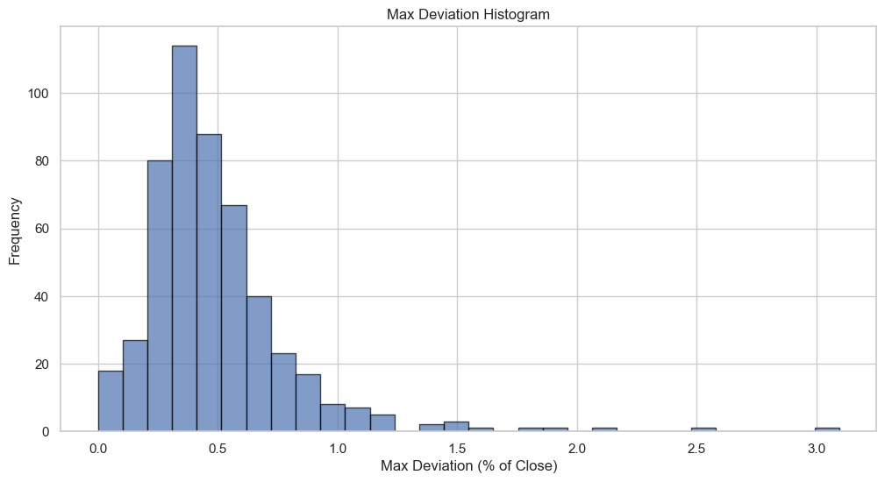
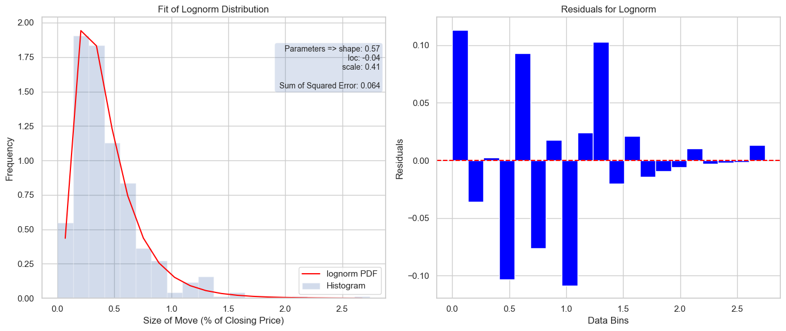
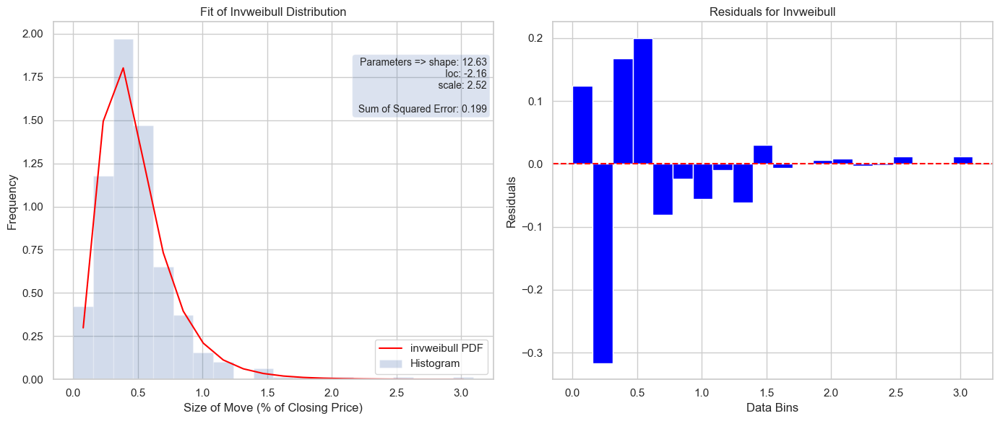
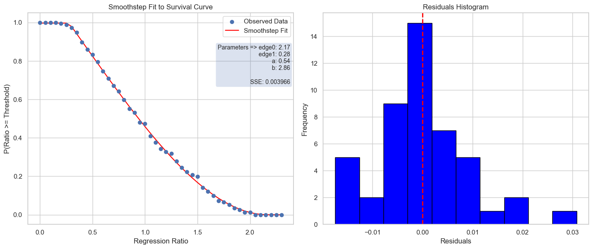
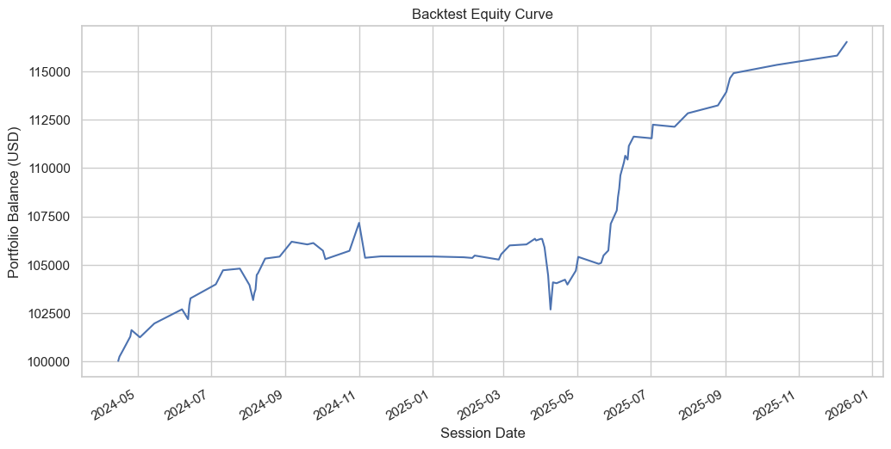
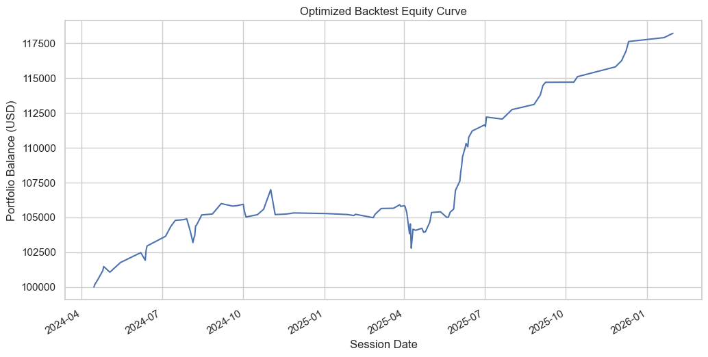

# Reversion in ZB Treasury Bond Futures: An After-Hours Analysis

**Jeffrey Hartigan**
*June 2023 (updated February 2026)*

---

## Abstract

This paper presents a quantitative analysis of price reversion in 30-year U.S. Treasury Bond futures (ZB) during after-hours trading sessions. Over 505 sessions from February 2024 to February 2026, we find that price retraces a median of 92.5% of its after-hours deviation from the prior close. We fit parametric distributions to the deviation and regression data, construct a survival curve for the regression ratio, and develop an expected value (EV) framework using double integration over the joint distribution of deviation and regression. A symmetric long/short strategy optimized via Nelder-Mead yields an 18.2% return ($18,201 on $100,000) over the two-year period, with 94 trades at a 71.3% win rate and a maximum drawdown of $4,476.

---

## 1. Introduction

Treasury bond futures are among the most liquid instruments in global derivatives markets. Their price behavior during off-peak hours when liquidity thins and institutional flow subsides exhibits patterns that differ meaningfully from regular trading sessions. This paper investigates one such pattern: the tendency of ZB futures to retrace the majority of their after-hours price deviation before the next session's open.

The hypothesis is straightforward. After the U.S. cash session closes, ZB futures continue trading in a lower-liquidity environment where price can drift materially from the closing level. By the time the next session opens, price has typically retraced most of that drift. If this retracement is both large enough and reliable enough, a systematic strategy can exploit it.

We analyze 505 after-hours sessions spanning February 13, 2024 through February 13, 2026. The data confirms the hypothesis: the median regression ratio, the fraction of the deviation that price retraces, is 92.5%, and price returns to within a few ticks of the prior close in 64.6% of sessions. Using fitted probability distributions for deviation and regression, we construct an expected value framework based on double integration that allows analytical evaluation of strategy profitability. A backtest of the optimized strategy produces an 18.2% return over the period with 94 trades.

The primary contribution of this work is not the specific parameter values, which will shift with each new data window, but the analytical framework itself: fitting continuous distributions to session-level metrics, deriving a closed-form expected value via integration, and using that EV surface to guide backtest optimization.

---

## 2. Data and Methods

### 2.1 Data Source

Hourly OHLC (Open, High, Low, Close) data for ZB=F was obtained from Yahoo Finance via the `yfinance` Python library. The dataset covers 10,530 hourly bars from February 13, 2024 to February 13, 2026, yielding 505 unique trading sessions.

### 2.2 Session Definition

ZB futures trade nearly 24 hours per day on CME Globex, but after-hours price action is defined relative to a reference close. Because the analysis was originally developed in the Dubai timezone (UTC+4), the after-hours window is defined as 1:00 AM to 4:00 PM local Dubai time. The 1:00 AM bar close serves as the session's reference price, and all subsequent bars within the window constitute the after-hours period. This timezone shift is merely a labeling convention — it captures the same U.S. post-close through pre-open window regardless of the analyst's location.

### 2.3 Session Metrics

For each session, five metrics are computed from the after-hours data:

1. **Max Deviation** - The largest absolute price move from the 1:00 AM close to any intra-session extreme:

$$
\text{maxDeviation} = \max\bigl(\text{high}_{\max} - \text{close}_{1\text{am}},\; \text{close}_{1\text{am}} - \text{low}_{\min}\bigr)
$$

2. **Max Deviation (%)** - Max deviation expressed as a percentage of the reference close:

$$
\text{maxDeviationPct} = \frac{\text{maxDeviation}}{\text{close}_{1\text{am}}} \times 100
$$

3. **Regression** - The amount of retracement from the extreme back toward the close, measured from the extreme to the best post-extreme price in the opposite direction.

4. **Regression (%)** - Regression expressed as a percentage of the reference close.

5. **Regression Ratio** - The fraction of the deviation that is retraced:

$$
\text{regressionRatio} = \frac{\text{regression}}{\text{maxDeviation}}
$$

A regression ratio of 1.0 means price fully retraced its deviation; values above 1.0 indicate an overshoot beyond the original close.

### 2.4 Distribution Fitting

We fit eight candidate probability distributions to both the max deviation (%) and regression (%) data using maximum likelihood estimation (MLE) via SciPy. The candidates are: Burr, Burr Type XII, Gumbel (right), LogNormal, Weibull (min), Weibull (max), Gamma, and Inverse Weibull (Fréchet). Each fit is ranked by sum of squared errors (SSE) against the empirical histogram density.

### 2.5 Survival Curve

A survival function for the regression ratio is constructed empirically:

$$
S(x) = P(\texttt{regressionRatio} \geq x)
$$

This is then approximated by a piecewise smoothstep polynomial fitted via nonlinear least squares.

### 2.6 Expected Value Framework

The expected value of a single trade is computed analytically via double integration over the fitted deviation and regression distributions. The EV function is then optimized over three strategy parameters (entry, stop, take-profit) using the Nelder-Mead simplex algorithm.

### 2.7 Backtesting

The optimized parameters are validated against a full historical simulation that processes each session chronologically, tracking entries, exits, and cumulative P&L. The backtest optimizer runs independently from its own initial parameters.

---

## 3. Results - Session Metrics

### 3.1 Summary Statistics

Over the 505 sessions analyzed, the key statistics are:

| Metric | Value |
|--------|-------|
| Sessions | 505 |
| Mean max deviation (%) | 0.49 |
| Median max deviation (%) | 0.43 |
| Std max deviation (%) | 0.31 |
| Mean regression (%) | 0.44 |
| Median regression (%) | 0.35 |
| Std regression (%) | 0.31 |
| Median regression ratio | 92.5% |
| Regression-to-close frequency | 64.6% |
| Direction (Up / Down) | 256 / 249 |

*Table 1: Summary statistics for after-hours session metrics, February 2024 - February 2026.*

The near-equal split between upward (50.7%) and downward (49.3%) sessions confirms that the after-hours drift has no persistent directional bias, supporting a symmetric strategy.

### 3.2 Interpretation

Both the deviation and regression distributions are positively skewed: the mean exceeds the median for both metrics. This is expected since most sessions exhibit moderate moves, but occasional large moves pull the mean higher. For strategy design, the median is more representative of the typical session than the mean.

The median regression ratio of 92.5% is the central result. In a typical session, price retraces more than nine-tenths of its after-hours deviation. The regression-to-close frequency of 64.6%, the fraction of sessions where price returns to within four ticks of the reference close, further confirms that mean reversion is the dominant after-hours dynamic.

*Figure 1: Max deviation (% of close) histogram. Periods of elevated volatility are visible, corresponding to macro events and FOMC announcements.*

---

## 4. Results — Distribution Fitting

### 4.1 Regression Distribution

Eight candidate distributions were fitted to the regression (%) data. The full ranking by SSE:

| Rank | Distribution | SSE | AIC | BIC |
|------|-------------|-----|-----|-----|
| 1 | Inverse Weibull | 0.158 | −51.7 | −39.0 |
| 2 | Burr | 0.158 | −49.5 | −32.6 |
| 3 | LogNormal | 0.163 | −48.3 | −35.6 |
| 4 | Burr Type XII | 0.173 | −44.3 | −27.4 |
| 5 | Gamma | 0.358 | −18.5 | −5.9 |
| 6 | Gumbel (right) | 0.470 | −6.0 | 2.4 |
| 7 | Weibull (min) | 0.752 | — | — |
| 8 | Weibull (max) | 6.530 | 823.1 | 835.7 |

*Table 2: Distribution fits for regression (%), ranked by SSE.*

We select the **LogNormal** distribution (ranked 3rd, SSE within 3% of the top-ranked distribution, though ranked #1 with 2023 data from the original analysis) for the regression model. This choice is motivated by analytical tractability rather than marginal SSE improvement:

- LogNormal has a closed-form PDF, well-understood moments, and wide use in financial modeling.
- It naturally captures the positive skew and lower bound at zero characteristic of regression amounts.
- Distribution rankings shift across data windows; the framework generalizes to any continuous distribution.

The LogNormal PDF with three parameters (shape $\sigma$, location $\mu$, scale $s$):

$$
f_{\text{LN}}(x;\,\sigma,\mu,s) = \frac{1}{\sigma\,(x - \mu)\,\sqrt{2\pi}}\;\exp\left(-\frac{\bigl[\ln\bigl(\frac{x-\mu}{s}\bigr)\bigr]^2}{2\sigma^2}\right), \quad x > \mu
$$

where $y = \frac{x - \mu}{s}$ is the standardized variable.

**Fitted parameters:**

| Parameter | Symbol | Value |
|-----------|--------|-------|
| Shape | $\sigma$ | 0.5659 |
| Location | $\mu$ | −0.0402 |
| Scale | $s$ | 0.4795 |

**Validation against observed statistics:**

| Moment | Theoretical | Observed | Error (%) |
|--------|------------|----------|-----------|
| Mean | 0.435% | 0.437% | 0.43 |
| Median | 0.365% | 0.349% | 4.43 |

*Table 3: LogNormal fit validation for regression data.*

*Figure 2: (Left) Histogram of regression (%) with LogNormal PDF overlay. (Right) Residuals between empirical density and fitted PDF.*

### 4.2 Deviation Distribution

The same eight candidates were fitted to the max deviation (%) data:

| Rank | Distribution | SSE | AIC | BIC |
|------|-------------|-----|-----|-----|
| 1 | Burr Type XII | 0.109 | −2.1 | 14.8 |
| 2 | Burr | 0.131 | −2.8 | 14.1 |
| 3 | Weibull (max) | 0.227 | 22.5 | 35.2 |
| 4 | Gumbel (right) | 0.234 | 20.5 | 28.9 |
| 5 | Inverse Weibull (Fréchet) | 0.298 | 11.1 | 23.8 |
| 6 | LogNormal | 0.363 | 19.0 | 31.7 |
| 7 | Gamma | 0.489 | 39.2 | 51.9 |
| 8 | Weibull (min) | 0.974 | 86.9 | 99.6 |

*Table 4: Distribution fits for max deviation (%), ranked by SSE.*

We select the **Fréchet (Inverse Weibull)** distribution (ranked 5th) for the deviation model. The theoretical motivation is stronger than the SSE ranking suggests:

- The Fréchet distribution belongs to the family of extreme value distributions and is specifically appropriate for modeling the maximum of a set of observations, which is precisely how max deviation is constructed.
- It offers closed-form moments and a three-parameter form amenable to integration in the EV framework.
- As with the regression model, the important contribution is the framework, not the specific distribution choice. The next analyst working on a different data window may find a different distribution ranks highest.

The Fréchet (Inverse Weibull) PDF:

$$
f_{\text{Fr}}(x;\,\alpha,m,s) = \frac{\alpha}{s}\left(\frac{x - m}{s}\right)^{-1-\alpha}\exp\left(-\left(\frac{x - m}{s}\right)^{-\alpha}\right), \quad x > m
$$

The theoretical moments:

$$
\text{mean} = m + s\,\Gamma\left(1 - \frac{1}{\alpha}\right), \qquad \text{median} = m + \frac{s}{(\ln 2)^{1/\alpha}}
$$

**Fitted parameters:**

| Parameter | Symbol | Value |
|-----------|--------|-------|
| Shape | $\alpha$ | 12.6268 |
| Location | $m$ | −2.1646 |
| Scale | $s$ | 2.5223 |

**Validation against observed statistics:**

| Moment | Theoretical | Observed | Error (%) |
|--------|------------|----------|-----------|
| Mean | 0.490% | 0.490% | 0.01 |
| Median | 0.432% | 0.427% | 1.04 |

*Table 5: Fréchet fit validation for max deviation data.*

*Figure 3: (Left) Histogram of max deviation (%) with Fréchet PDF overlay. (Right) Residuals between empirical density and fitted PDF.*

---

## 5. Results — Survival Curve

The empirical survival function $S(x) = P(\text{regressionRatio} \geq x)$ quantifies the probability that a session's regression ratio exceeds a given threshold. This provides a direct view of how reliable the retracement behavior is across different targets.

### 5.1 Smoothstep Fit

A piecewise smoothstep polynomial was fitted to the empirical survival curve:

$$
S(x) =
\begin{cases}
1 & \text{if } x \leq \text{edge}_0 \\[4pt]
a \cdot t^2 \cdot (b - t) & \text{if } \text{edge}_0 < x < \text{edge}_1 \\[4pt]
0 & \text{if } x \geq \text{edge}_1
\end{cases}
$$

where $t = \frac{x - \text{edge}_0}{\text{edge}_1 - \text{edge}_0}$ is the normalized position within the transition region.

**Fitted parameters:**

| Parameter | Value |
|-----------|-------|
| edge₀ | 2.168 |
| edge₁ | 0.277 |
| a | 0.536 |
| b | 2.862 |
| **SSE** | **0.00397** |

*Table 6: Smoothstep survival curve fit parameters.*

The CDF and PDF follow from the survival function:

$$
F(x) = 1 - S(x), \qquad f(x) = \frac{d}{dx}\,F(x)
$$

### 5.2 From Smoothstep to Continuous Distributions

Although the smoothstep model provides a tight fit to the empirical survival curve (SSE = 0.004), we ultimately rely on standard parametric distributions (LogNormal and Fréchet) for the expected value computation. The reasons are practical:

- Standard distributions have well-understood tail behavior, which matters for integration bounds extending to infinity.
- SciPy provides built-in PDF, CDF, and SF functions for standard distributions, enabling reliable numerical integration via `dblquad`.
- The smoothstep model is piecewise-defined with compact support, which introduces boundary artifacts in integration.

The survival curve analysis is valuable for understanding the shape of the retracement probability landscape, but the continuous distributions are the operational inputs to the EV framework.

*Figure 4: (Left) Empirical survival curve with smoothstep fit overlay. (Right) Residuals histogram.*

---

## 6. Discussion

### 6.1 Skewness and Central Tendency

Both deviation and regression distributions are right-skewed. For both metrics, the mean exceeds the median. This has practical implications: a strategy calibrated to the mean will expect larger moves than typically occur. The median is the more appropriate anchor for position sizing and expectation management.

### 6.2 Variance and Simple Threshold Strategies

The standard deviations for deviation (0.31%) and regression (0.31%) are of the same order as the medians (0.43% and 0.35%). This high coefficient of variation means that simple fixed-threshold strategies (enter at X%, exit at Y%) will frequently encounter sessions where the move is too small to trigger entry or too large to avoid the stop. A probabilistic framework that accounts for the full distribution shape is essential.

### 6.3 Probability Analysis

Using the fitted Fréchet distribution for deviation, we compute key probabilities at the initial strategy parameters (entry = 0.71%, stop = 2.23%):

$$
P(\text{stop}) = \text{sf}_{\text{Fr}}(2.23\%) = 0.089\%
$$

$$
P(\text{entry}) = F_{\text{Fr}}(2.23\%) - F_{\text{Fr}}(0.71\%) = 17.5\%
$$

$$
\text{Risk/Reward Ratio} = \frac{P(\text{entry})}{P(\text{stop})} = 196.47
$$

The probability of being stopped out is approximately 200 times less likely than the probability of a valid entry. This extreme asymmetry in entry-to-stop probability is what makes the strategy viable despite the modest per-trade expected value.

---

## 7. Trading Strategy

### 7.1 Strategy Description

The strategy is symmetric: it places both a long and a short order at a fixed percentage distance from the 1:00 AM close. Only one side can trigger per session, since the entry threshold is set at the deviation level, once price moves far enough in one direction to trigger entry, the opposite-side order becomes unreachable within the same session.

### 7.2 Order Mechanics

For each session, three levels are computed as percentages of the reference close $C$:

- **Entry**: $C \pm \text{entryPct}\%$ - limit orders placed above and below the close
- **Stop Loss**: $C \pm \text{stopPct}\%$ - stop orders placed beyond entry in the direction of the deviation
- **Take Profit**: deviation extreme minus $\text{tpPct}\%$ of $C$ - limit order placed back toward the close

If price reaches the entry level, the trade is initiated. If price subsequently hits the stop, the trade is closed at a loss. If the regression carries price back to the take-profit level, the trade is closed at a gain. If neither the stop nor take-profit is hit, the trade is closed at the session's final price.

### 7.3 Relative Percentages

All levels are expressed as percentages of the closing price rather than absolute dollar amounts. This ensures the strategy adapts automatically to changes in ZB's price level over time.  A 0.68% entry on a $116 contract is different in absolute terms from the same percentage on a $120 contract, but the statistical properties of the after-hours retracement are defined in percentage terms.

---

## 8. Expected Value Framework

### 8.1 Three-Component Decomposition

The expected value of a single trade decomposes into three scenarios based on the relationship between the max deviation $y$ and regression $x$:

**Component 1: Stopped Out** — Max deviation exceeds the stop level. The trade enters but is stopped out for a loss.

$$
\text{EV}_{\text{stop}} = \text{sf}_{\text{Fr}}(\text{stop}) \cdot (\text{entry} - \text{stop})
$$

Note that $(\text{entry} - \text{stop})$ is negative since $\text{stop} > \text{entry}$.

**Component 2: Partial Regression** - The trade enters (deviation between entry and stop) but regression does not reach the take-profit target.

$$
\text{EV}_{\text{partial}} = \int_{\text{entry}}^{\text{stop}} \int_{0}^{y - \text{tp}} f_{\text{Fr}}(y) f_{\text{LN}}(x) (\text{entry} - y + x) dx dy
$$

**Component 3: Full Regression** - The trade enters and regression reaches or exceeds the take-profit level.

$$
\text{EV}_{\text{full}} = (\text{entry} - \text{tp}) \int_{\text{entry}}^{\text{stop}} \int_{y - \text{tp}}^{\infty} f_{\text{Fr}}(y) f_{\text{LN}}(x) dx dy
$$

### 8.2 Combined EV Integral

The total expected value per trade is the sum of all three components:

$$
\text{EV} = \text{sf}_{\text{Fr}}(\text{stop}) \cdot (\text{entry} - \text{stop}) + \int_{\text{entry}}^{\text{stop}} \left[\int_{0}^{y-\text{tp}} f_{\text{Fr}}(y)f_{\text{LN}}(x)(\text{entry} - y + x)dx + (\text{entry} - \text{tp})\int_{y-\text{tp}}^{\infty} f_{\text{Fr}}(y)f_{\text{LN}}(x)dx \right] dy
$$

This integral is evaluated numerically using `scipy.integrate.dblquad`.

### 8.3 Optimization

The EV function is maximized over the three strategy parameters $(\text{entry},\, \text{stop},\, \text{tp})$ using the Nelder-Mead simplex algorithm. Boundary constraints enforce physical validity: $\text{stop} > \text{entry} > \text{tp} \geq 0$ and $\text{stop} \leq 5\%$.

**Optimized parameters:**

| Parameter | Value |
|-----------|-------|
| Entry (%) | 0.3989 |
| Stop (%) | 2.8912 |
| Take Profit (%) | ≈ 0.0000 |
| **EV per trade** | **0.0589%** |

*Table 7: Nelder-Mead optimized EV parameters.*

The optimizer drives take-profit to approximately zero, indicating that the EV-maximizing strategy holds for maximum regression rather than taking early profits.

### 8.4 Dollar Conversion

The EV per trade converts to dollars using the contract's tick structure:

$$
\text{Gain} = C_{\text{median}} \times \frac{\text{EV}}{100} \times \text{ticks/point} \times \text{dollar/tick} \times N_{\text{sessions}}
$$

With the median close of $116.28, 32 ticks per point, $31.25 per tick, and 505 sessions:

$$
\text{Gain} = 116.28 \times \frac{0.0589}{100} \times 32 \times 31.25 \times 505 = \$34{,}558
$$

This is the EV model's theoretical prediction assuming every session generates a trade.

---

## 9. Backtest

### 9.1 Initial Backtest

An initial backtest with parameters close to the EV-optimized region (entry = 0.7081%, stop = 2.2343%, take-profit = 0.0951%) produces:

| Metric | Value |
|--------|-------|
| Trades | 80 |
| Win rate | 71.3% |
| Total P&L | $16,517 |
| Max drawdown | $4,476 |
| Return (%) | 16.5% |

*Table 8: Initial backtest results on a $100,000 starting balance.*

### 9.2 Optimized Backtest

Running Nelder-Mead directly on the backtest objective (ending balance) yields refined parameters:

| Parameter | Initial | Optimized |
|-----------|---------|-----------|
| Entry (%) | 0.7081 | 0.6775 |
| Stop (%) | 2.2343 | 2.1899 |
| Take Profit (%) | 0.0951 | 0.0823 |
| **Total P&L** | **$16,517** | **$18,201** |
| Trades | 80 | 94 |
| Return (%) | 16.5% | 18.2% |

*Table 9: Initial vs. optimized backtest parameters and results.*

*Figure 5: Equity curve for the initial backtest. Periods of consolidation and rapid equity growth are visible, corresponding to different volatility regimes.*

*Figure 6: Equity curve for the optimized backtest. The lower entry threshold captures more trades while maintaining a similar win rate.*

### 9.3 EV Model vs. Backtest Comparison

| Metric | EV Optimized | Initial Backtest | Optimized Backtest |
|--------|-------------|-----------------|-------------------|
| Entry (%) | 0.3989 | 0.7081 | 0.6775 |
| Stop (%) | 2.8912 | 2.2343 | 2.1899 |
| Take Profit (%) | 0.0000 | 0.0951 | 0.0823 |
| Total Gain ($) | $34,558 | $16,517 | $18,201 |
| Num Trades | 505 | 80 | 94 |

*Table 10: Comparison of EV model predictions against backtest results.*

The EV model predicts $34,558 while the optimized backtest produces $18,201. This gap has a clear explanation: the EV model assumes every session generates a trade (505 sessions), while the backtest only triggers entries in 94 of 505 sessions (18.6%). The EV model's entry threshold (0.40%) is lower than the backtest's (0.68%), so many sessions where the deviation falls between these thresholds would contribute to the EV calculation but not trigger a backtest trade.

The EV framework is not meant to predict exact dollar returns. Its value lies in validating that the strategy has positive expected value across the parameter space and identifying the region of parameter space most likely to be profitable. The backtest provides the operationally realistic return estimate.

---

## 10. Risk Considerations

### 10.1 Drawdown

The maximum drawdown during the optimized backtest is $4,476 on a $100,000 account (4.5%). While modest relative to the total return, drawdowns of this magnitude can occur during periods of elevated volatility when multiple consecutive stop-outs coincide with suppressed regression.

### 10.2 Capital Requirements

A conservative starting balance for this strategy is $100,000, which provides:

- Sufficient margin for one ZB futures contract (current CME initial margin is approximately $4,800)
- A buffer of more than 20× the observed maximum drawdown
- Room to absorb a drawdown several times larger than the historical maximum without a margin call

Traders with smaller accounts should consider micro Treasury futures (e.g., /MBT) if there is sufficient liquidity or paper-trade the strategy to build confidence before committing capital.

### 10.3 Regime Sensitivity

The two-year analysis window includes both high-volatility periods (FOMC meetings, macro surprises) and consolidation phases. The equity curve exhibits clear regime dependence — profits concentrate in volatile periods when deviations are large enough to trigger entries. During low-volatility regimes, the strategy may go weeks without a trade. This is by design: the high entry threshold filters for sessions with enough deviation to offer favorable risk/reward.

### 10.4 Model Risk

The strategy is built on distributional assumptions that may not hold in future data. The LogNormal and Fréchet fits, while validated on the current window, could degrade if the market microstructure of after-hours Treasury trading changes materially (e.g., due to regulatory changes, new market participants, or structural shifts in liquidity provision).

---

## 11. Future Work

Several extensions would strengthen the analysis:

- **Longer historical data**: Extending the dataset beyond two years would provide more robust distribution estimates and capture a wider range of market regimes.
- **Epoch analysis**: Segmenting the data into volatility regimes (e.g., FOMC weeks vs. non-FOMC weeks, or high-VIX vs. low-VIX periods) could reveal whether the strategy's edge concentrates in specific conditions.
- **Macro correlation**: Investigating the relationship between after-hours mean reversion and macro variables (yield curve slope, realized volatility, scheduled data releases) could improve entry timing.
- **Walk-forward analysis**: Re-fitting distributions on rolling windows and evaluating out-of-sample performance would test the framework's robustness to parameter drift.
- **Other instruments**: The framework is not specific to ZB. Applying it to other Treasury futures (ZN, ZF, UB), equity index futures (ES, NQ), or commodity futures could identify additional mean-reversion opportunities.
- **Options overlay**: Combining the futures strategy with options (e.g., selling strangles aligned with the mean-reversion thesis) could enhance returns or reduce risk.

---

## 12. Conclusion

This analysis confirms that after-hours mean reversion in ZB Treasury Bond futures is a persistent, quantifiable phenomenon. Over 505 sessions spanning two years, the median regression ratio is 92.5%, showing that price typically retraces more than nine-tenths of its after-hours deviation. A symmetric long/short strategy built on this observation produces an 18.2% return with a 71.3% win rate and a maximum drawdown of 4.5%.

The analytical framework,fitting continuous distributions to session metrics and computing expected value via double integration, provides a rigorous foundation for strategy evaluation that goes beyond simple historical backtesting. The EV model identifies the profitable region of parameter space analytically, while the backtest validates performance under realistic execution constraints.

The specific numbers reported here will evolve as new data arrives. The framework is designed to accommodate this: re-fitting distributions on updated data, re-optimizing the EV surface, and re-running the backtest is a fully automated pipeline. The contribution is the methodology, not the parameters.

---

## Appendix: Equations Reference

### A.1 LogNormal PDF

$$
f_{\text{LN}}(x;\,\sigma,\mu,s) = \frac{1}{\sigma\,(x - \mu)\,\sqrt{2\pi}}\exp\left(-\frac{\bigl[\ln\!\bigl(\frac{x-\mu}{s}\bigr)\bigr]^2}{2\sigma^2}\right), \quad x > \mu
$$

### A.2 Fréchet PDF

$$
f_{\text{Fr}}(x;\,\alpha,m,s) = \frac{\alpha}{s}\left(\frac{x - m}{s}\right)^{-1-\alpha}\exp\left(-\left(\frac{x - m}{s}\right)^{-\alpha}\right), \quad x > m
$$

### A.3 Fréchet Moments

$$
\text{mean} = m + s\,\Gamma\left(1 - \frac{1}{\alpha}\right), \qquad \text{median} = m + \frac{s}{(\ln 2)^{1/\alpha}}
$$

### A.4 Survival Function

$$
S(x) = 1 - F(x)
$$

where $F(x)$ is the cumulative distribution function.

### A.5 Smoothstep Survival Model

$$
S(x) =
\begin{cases}
1 & x \leq \text{edge}_0 \\[4pt]
a \cdot t^2(b - t) & \text{edge}_0 < x < \text{edge}_1 \\[4pt]
0 & x \geq \text{edge}_1
\end{cases}
\quad \text{where } t = \frac{x - \text{edge}_0}{\text{edge}_1 - \text{edge}_0}
$$

### A.6 Expected Value — Combined Integral

$$
\text{EV} = \underbrace{\text{sf}_{\text{Fr}}(\text{stop}) \cdot (\text{entry} - \text{stop})}_{\text{stopped out}} + \underbrace{\int_{\text{entry}}^{\text{stop}} \int_{0}^{y-\text{tp}} f_{\text{Fr}}(y)f_{\text{LN}}(x)(\text{entry} - y + x)dx\,dy}_{\text{partial regression}} + \underbrace{(\text{entry} - \text{tp})\int_{\text{entry}}^{\text{stop}} \int_{y-\text{tp}}^{\infty} f_{\text{Fr}}(y)f_{\text{LN}}(x)\,dx\,dy}_{\text{full regression}}
$$

### A.7 Dollar Gain Formula

$$
\text{Gain} = C_{\text{median}} \times \frac{\text{EV}}{100} \times \text{ticks/point} \times \text{dollar/tick} \times N_{\text{sessions}}
$$
